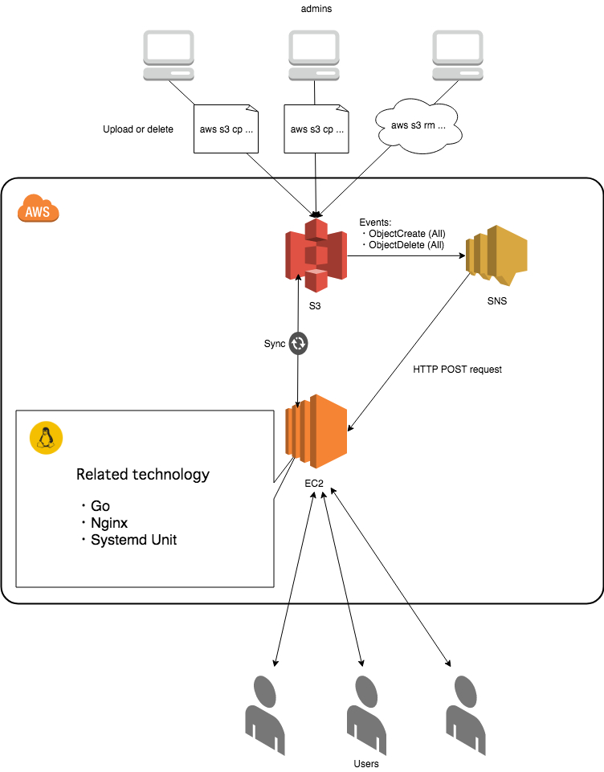

# tinyGoWebServer

[](https://travis-ci.org/falgon/tinyGoWebServer)

Tiny Go Web Server. AWS SNS + S3 + EC2 + Nginx Fast-CGI + systemd technology automatically synchronizes content on S3 bucket.

## System structure



## Build

```sh
$ make
go build -o appserver src/index.go
Bins are in dst :)
```

## Config & Usage

Change the target AWS SNS topic policy([ref](https://docs.aws.amazon.com/ja_jp/AmazonS3/latest/dev/ways-to-add-notification-config-to-bucket.html#step1-create-sns-topic-for-notification)). 
E.g.:

```json
{
  "Version": "2008-10-17",
  "Id": "__default_policy_ID",
  "Statement": [
    {
      "Sid": "__default_statement_ID",
      "Effect": "Allow",
      "Principal": {
        "AWS": "*"
      },
      "Action": [
        "SNS:GetTopicAttributes",
        "SNS:SetTopicAttributes",
        "SNS:AddPermission",
        "SNS:RemovePermission",
        "SNS:DeleteTopic",
        "SNS:Subscribe",
        "SNS:ListSubscriptionsByTopic",
        "SNS:Publish",
        "SNS:Receive"
      ],
      "Resource": "SNS-topic-ARN",
      "Condition": {
        "ArnLike": {
          "aws:SourceArn": "arn:aws:s3:*:*:bucket-name"
        }
      }
    }
  ]
}
```

The usage is as follows.

```sh
$ ./dst/appserver --help
Usage of ./dst/appserver:
  -contents_root string
        The path of the contents root (default "/var/www/html/")
  -listenIP string
        The Listen IP address and port number (default "127.0.0.1:9000")
  -nfpage string
        The filename of the custome 404 page (default "404.html")
  -root string
        The path of the root (default "/")
  -sync_endpoint string
        The path of the endpoint (default "/sns_notify")
```

By default, the endpoint for receiving HTTP POST requests from AWS SNS is set to the path 
`/sns_notify`. 
Also, in the configuration within confeg, the synchronization script with the S3 bucket and the web server main body are set to be arranged according to
[Filesystem Hierarchy Standard](http://www.pathname.com/fhs/).

If it fails to synchronize with the S3 bucket, it is designed to inform the administrator by e-mail to that effect. To use this, change the setting of the `./getcontents.sh`.
